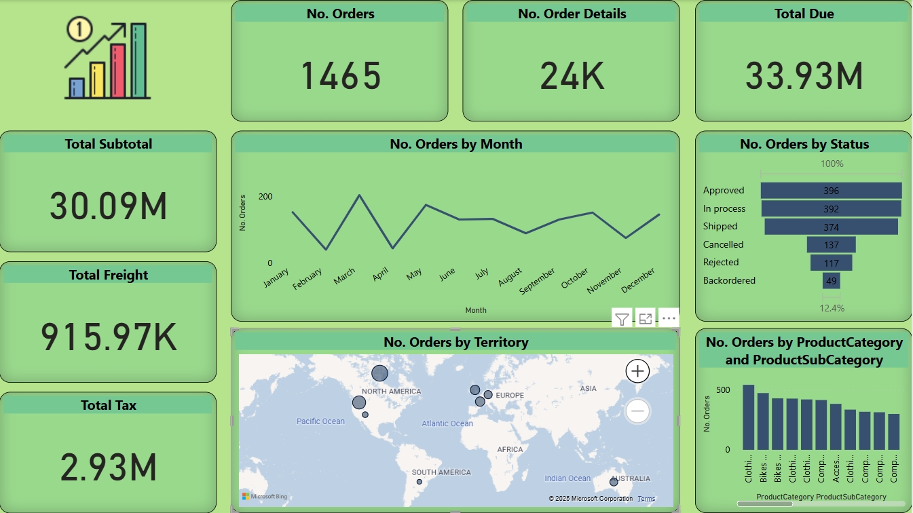

# Power BI Projects Portfolio

<small> Welcome to my Power BI projects repository! This collection showcases my work in data analysis and visualization using Microsoft Power BI during my journey at ITI From March 2025 to July 2025.

I aim to demonstrate my proficiency in transforming raw data into actionable insights through interactive dashboards and reports.

## Skills Demonstrated

* **Data Transformation & Cleansing:** Proficient in Power Query for data extraction, transformation, and loading (ETL).
* **DAX Expertise:** Skilled in writing complex DAX formulas for custom measures, calculated columns, and tables.
* **Data Modeling:** Designing robust and efficient data models, managing relationships, and optimizing performance.
* **Interactive Dashboard Design:** Creating intuitive and visually appealing dashboards that enable users to explore data dynamically.
* **Reporting & Visualization:** Utilizing a wide range of Power BI visualizations to communicate insights effectively.
* **Connecting to Diverse Data Sources:** Experience with SQL databases, Excel, CSVs, and other data sources.
---

## Projects Overview

### 1. AdventureWorks2022 Analysis

* **Description:** This project involved analyzing sales data from the AdventureWorks2022 database to identify trends, top-performing products, and customer segments.
* **Technologies:** Power BI Desktop, SQL Server.

### 2. Flights Analysis

* **Description:** A detailed analysis of flight delay data to uncover common causes of delays, visualize airline performance, and identify peak travel times.
* **Key Insights:** Highlighted the impact of specific airports and weather conditions on flight punctuality.
* **Technologies:** Power BI Desktop, CSV Data.

### 3. Hotel Analysis

* **Description:** Focused on analyzing hotel booking data to understand occupancy rates, revenue trends, and customer booking preferences.
* **Key Insights:** Provided recommendations for optimizing pricing strategies and improving customer satisfaction.
* **Technologies:** Power BI Desktop, Excel Data.

### 4. Sales Analysis

* **Description:** Comprehensive sales performance analysis, including product sales, regional performance, and sales team efficiency.
* **Key Insights:** Identified underperforming sales regions and opportunities for product promotion.
* **Technologies:** Power BI Desktop, SQL Server, Excel.

----
## Contact

Feel free to connect with me on [LinkedIn](https://www.linkedin.com/in/ahmedayman99/) or reach out via email at [ahmedayman1077@gmail.com](mailto:ahmedayman1077@gmail.com).
